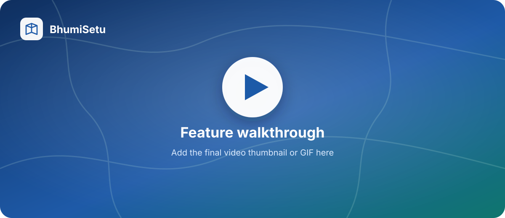
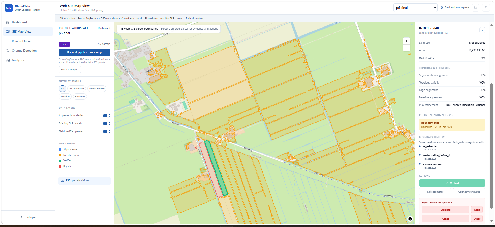
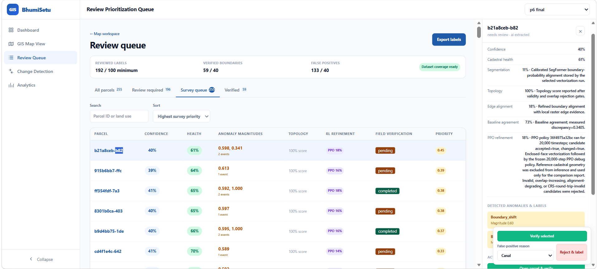
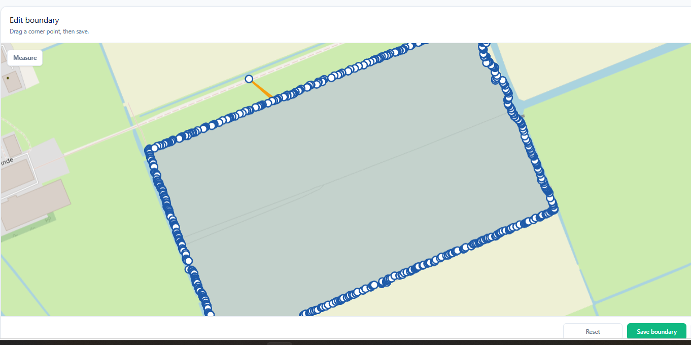
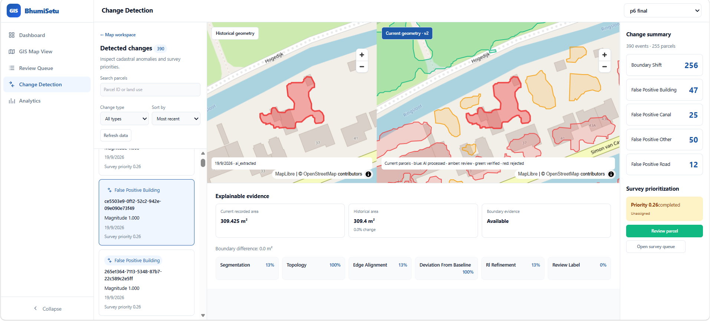
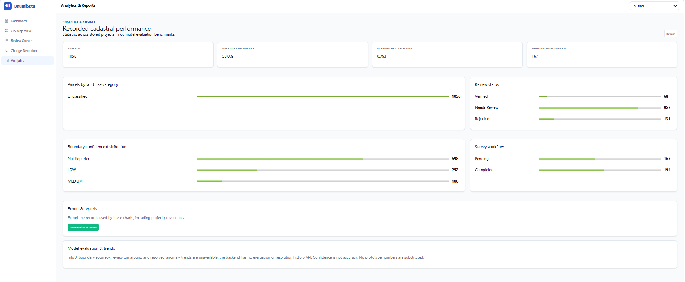

# BhumiSetu – AI-Based Urban Cadastral Mapping Platform

BhumiSetu is an evidence-backed cadastral intelligence platform that converts geospatial imagery into reviewable parcel boundaries. It combines SegFormer-based boundary extraction, topology-aware vectorization, PPO refinement, a FastAPI/PostGIS backend, and an interactive Web-GIS for verification, editing, change detection, and human-feedback collection.

The system is designed for **AI-assisted parcel mapping**: model output is never treated as legal ground truth until it has been inspected or corrected by a reviewer.

## 🎥 Demo

<!-- Replace this image with a linked video thumbnail when the final overview video is ready. -->

<p align="center">
  
</p>

**Overview video location:** `docs/media/00-overview.mp4`

<p align="center">
  
</p>

## 🌟 Features

### 1. AI Parcel Extraction and Web-GIS Mapping

- Displays AI-extracted parcel polygons on an interactive MapLibre map.
- Supports large refined GeoJSON outputs with matching model-evidence payloads.
- Uses separate colors for AI processed, needs review, verified, and rejected parcels.
- Provides parcel search, review filters, layer controls, and project switching.
- Keeps existing GIS parcels and field-verified parcels as separate map layers.

<p align="center">
  
</p>

> 🎬 **Feature video slot:** `docs/media/01-map-workspace.mp4`

### 2. Explainable Confidence and Boundary Evidence

Each parcel can display evidence imported from the actual processing pipeline:

- Boundary confidence
- Cadastral health score
- Segmentation alignment
- Topology validity
- Raster edge alignment
- Baseline agreement
- Post-PPO alignment
- Recorded anomaly magnitudes

The interface does not generate random scores. Values are stored by the backend from the matching refined-payload metadata. If a reviewer manually changes a boundary, stale model scores are removed and the parcel is marked **Boundary edited**.

> 🎬 **Feature video slot:** `docs/media/02-evidence-panel.mp4`

### 3. Review Prioritization and Human Labelling

- Sorts parcels by confidence or survey priority.
- Separates all parcels, review-required parcels, survey work, and verified parcels.
- Lets reviewers verify genuine parcel boundaries.
- Lets reviewers reject false polygons as a building, road, canal, or other object.
- Tracks positive boundaries and hard negatives required for training readiness.
- Exports explicit human decisions as a training-oriented GeoJSON file.

<p align="center">
  
</p>

> 🎬 **Feature video slot:** `docs/media/03-review-and-label.mp4`

### 4. Interactive Boundary Editor and Measurement

- Edits parcel geometry directly on the map instead of exposing raw JSON.
- Allows reviewers to drag parcel corner points.
- Reduces dense model polygons to approximately 5 points for simple shapes and 10 points for larger irregular shapes.
- Provides area and perimeter measurement.
- Supports reset and save actions.
- Saves a new geometry version and returns the reviewer to the Web-GIS map.

<p align="center">
  
</p>

> 🎬 **Feature video slot:** `docs/media/04-boundary-editor.mp4`

### 5. Change Detection and Boundary History

- Compares the current parcel with its most recent distinct historical geometry.
- Shows historical and current boundaries side by side.
- Calculates geodesic current area, historical area, and changed area.
- Displays recorded anomaly type, magnitude, date, and survey priority.
- Links directly to parcel review and the survey queue.

<p align="center">
  
</p>

> 🎬 **Feature video slot:** `docs/media/05-change-detection.mp4`

### 6. Analytics and Reports

- Total stored parcels
- Average recorded boundary confidence
- Average cadastral health score
- Pending field surveys
- Parcel counts by land-use category
- Review-status distribution
- Confidence-band distribution
- Survey-workflow progress
- Downloadable JSON report

<p align="center">
  
</p>

> 🎬 **Feature video slot:** `docs/media/06-analytics.mp4`

### 7. Human Feedback-to-Training Loop

- Verified geometry becomes a `positive_boundary` label.
- Rejected buildings, roads, canals, and other detections become class-specific `hard_negative` labels.
- Untouched AI output is excluded from the human-feedback export.
- Reviewed examples remain training-only.
- Independent validation and test locations remain unchanged.
- A readiness audit checks coverage, CRS, files, splits, masks, and spatial isolation before expensive training begins.

### 8. Safe Project and Data Management

- Creates and imports multiple cadastral projects.
- Requires matched parcel IDs and geometries when importing evidence companions.
- Stores parcel geometry, evidence, review history, survey work, and anomalies in PostGIS.
- Supports project switching from the global header.
- Provides a compact delete button with confirmation before removing a project and its dependent records.
- Preserves versioned model reports instead of overwriting canonical results.

## 🧠 Processing Pipeline

```text
Geospatial imagery
       │
       ▼
SegFormer boundary probability maps
       │
       ▼
Line-network vectorization and polygonization
       │
       ▼
Topology validation
       │
       ▼
PPO vertex refinement
       │
       ▼
Refined parcel GeoJSON + evidence payload
       │
       ▼
FastAPI + PostGIS
       │
       ▼
Web-GIS review, editing, history, and label export
```

### Model Promotion Rules

A checkpoint is not accepted simply because its training loss improves. Candidate models are evaluated using:

- Validation and independent test pixel metrics
- False-positive rate
- Held-out parcel vectorization
- Polygon harmonic IoU
- Topology validity and overlap checks
- Target comparison performed only after candidate generation
- Post-PPO accuracy and geometry validity

The calibrated retained candidate recorded:

- Validation pixel IoU improvement: `+0.0035702`
- Test pixel IoU improvement: `+0.0027308`
- Held-out polygon harmonic IoU improvement: `+0.0222573`
- Target post-PPO IoU: `0.1172371`
- Invalid or overlapping output geometries: `0`

Detailed experiment records are available in [ml-pipeline/segmentation/README.md](ml-pipeline/segmentation/README.md).

## 🛠️ Technology Stack

### Frontend

- Framework: React 18
- Language: TypeScript
- Build tool: Vite
- Mapping: MapLibre GL
- Routing: React Router
- Styling: Responsive CSS component system

### Backend

- Framework: FastAPI
- Validation: Pydantic
- ORM: SQLAlchemy and GeoAlchemy2
- Spatial operations: PostGIS and Shapely
- Database migrations: Alembic
- Background services: Celery and Redis

### Machine Learning and Geospatial Processing

- Segmentation: SegFormer
- Raster processing: Rasterio and NumPy
- Vector processing: Shapely and GeoPandas-compatible outputs
- Reinforcement learning: Gymnasium and Stable-Baselines3 PPO
- Geometry exchange: GeoJSON in `EPSG:4326`
- Metric processing: projected CRS, currently `EPSG:32645`

### Infrastructure

- Docker Compose
- PostgreSQL 16 with PostGIS
- Redis
- JarvisLabs GPU training workflow

## 🚀 Setup Instructions

### Prerequisites

- Git
- Docker Desktop
- Node.js 18 or newer
- npm
- At least 8 GB of available RAM recommended for the complete local stack

### 1. Clone the Repository

```bash
git clone https://github.com/Rushilp21/SIH26-CodeYodha.git
cd SIH26-CodeYodha
```

### 2. Configure the Environment

PowerShell:

```powershell
Copy-Item .env.example .env
```

Git Bash or Linux:

```bash
cp .env.example .env
```

The default local configuration uses:

```text
API:        http://localhost:8000
Web-GIS:    http://localhost:5173
PostgreSQL: localhost:5432
Redis:      localhost:6379
```

### 3. Start the Backend Services

From the repository root:

```bash
docker compose up -d --build
docker compose ps
```

The following services should start:

- `bhumisetu-postgres`
- `bhumisetu-redis`
- `bhumisetu-api`
- Celery worker
- One-time database migration container

Check the service health:

```bash
curl http://localhost:8000/health
curl http://localhost:8000/health/postgis
```

PowerShell alternative:

```powershell
Invoke-RestMethod http://localhost:8000/health
Invoke-RestMethod http://localhost:8000/health/postgis
```

### 4. Start the Web-GIS

Open a second terminal:

```bash
cd frontend/web-gis
npm install
npm run dev
```

Open [http://localhost:5173](http://localhost:5173).

FastAPI documentation is available at [http://localhost:8000/docs](http://localhost:8000/docs).

### 5. Import the Refined Demonstration Output

On the Dashboard, create a project and select the following matching files:

**Parcel GeoJSON**

```text
data/processed/vectorization_v4_calibrated/
parcels_vectorized_rl_refined_v4_calibrated.geojson
```

**Evidence companion**

```text
data/processed/vectorization_v4_calibrated/
refined_parcel_payloads_v4_calibrated.json
```

Click **Create & import**, open the new project, and use **Refresh outputs** if the map is already open.

> Model training is not required to demonstrate the application. The repository includes versioned refined output and evidence files for the Web-GIS workflow.

### 6. Stop the Platform

```bash
docker compose down
```

The named PostGIS volume is retained. Use `docker compose down -v` only when you intentionally want to erase the local database.

## ✅ Validation and Tests

### Frontend Production Build

```bash
cd frontend/web-gis
npm run build
```

### Backend Contract Tests

From the repository root, while Docker is running:

```bash
docker compose exec -T api python -m unittest backend.api.tests.test_gis_contracts
```

Current verified result: **frontend build passes and all 10 API contract tests pass**.

### ML Module Tests

Each pipeline module keeps its own tests and instructions:

- [Segmentation](ml-pipeline/segmentation/README.md)
- [Vectorization](ml-pipeline/vectorization/README.md)
- [RL refinement](ml-pipeline/rl-refinement/README.md)

## 📁 Project Structure

```text
SIH26-CodeYodha/
├── backend/
│   ├── api/
│   │   ├── app/
│   │   │   ├── routers/             # Project, parcel, review, history APIs
│   │   │   ├── schemas/             # Pydantic request/response contracts
│   │   │   ├── services/            # Geometry and parcel helpers
│   │   │   └── tasks/               # Celery task integration
│   │   └── tests/                    # API contract tests
│   └── db/
│       ├── alembic/                  # Database migrations
│       ├── models/                   # PostGIS ORM entities
│       └── session.py                # Database session configuration
├── frontend/
│   ├── web-gis/
│   │   ├── src/
│   │   │   ├── api/                  # FastAPI client
│   │   │   ├── components/           # Shared GIS interface components
│   │   │   ├── map/                  # Map rendering and boundary editing
│   │   │   ├── pages/                # Dashboard, map, review, change, analytics
│   │   │   └── styles/               # Page and component styles
│   │   └── package.json
│   ├── admin-vendor/                 # Administrative frontend
│   └── shared/                       # Shared frontend types
├── ml-pipeline/
│   ├── ingestion/                    # Imagery preparation
│   ├── segmentation/                 # SegFormer training and inference
│   ├── vectorization/                # Raster-to-parcel conversion
│   └── rl-refinement/                # PPO boundary refinement
├── data/
│   ├── raw/                          # Source/demo segmentation files
│   └── processed/                    # Versioned outputs and reports
├── shared-schemas/                   # Shared API and GeoJSON contracts
├── docs/media/                       # README screenshots and video slots
├── infra/docker/                     # Dockerfiles
├── docker-compose.yml
└── README.md
```

## 🔌 Important API Endpoints

| Method | Endpoint | Purpose |
|---|---|---|
| `GET` | `/health` | API health check |
| `GET` | `/health/postgis` | PostGIS health check |
| `GET` | `/projects` | List projects |
| `POST` | `/projects` | Create a project |
| `DELETE` | `/projects/{project_id}` | Delete a project and dependent records |
| `POST` | `/projects/{project_id}/parcels/pipeline-import` | Import refined parcels and evidence |
| `GET` | `/projects/{project_id}/review-labels/export` | Export reviewed training labels |
| `GET` | `/parcels` | List project parcels |
| `GET` | `/parcels/{parcel_id}/history` | Retrieve boundary versions |
| `GET` | `/parcels/{parcel_id}/comparison` | Compare historical and current geometry |
| `POST` | `/parcels/{parcel_id}/verify` | Verify, reject, or save edited geometry |
| `GET` | `/survey-queue` | Retrieve prioritized survey work |

## 🧭 Recommended Judge Demonstration

1. Open the Dashboard and select the imported project.
2. Show parcel coverage in **GIS Map View**.
3. Select a parcel and explain confidence, topology, edge, baseline, and PPO evidence.
4. Open **Review Queue** and verify one genuine parcel.
5. Reject one obvious building, road, or canal false positive.
6. Edit a parcel boundary, measure it, and save the change.
7. Open **Change Detection** and compare historical/current geometry.
8. Export reviewed labels and show training-readiness counts.
9. Finish with the **Analytics** page and JSON report export.

## 🛠️ Troubleshooting

### Frontend reports that the API is unreachable

1. Confirm Docker Desktop is running.
2. Run `docker compose ps`.
3. Open [http://localhost:8000/health](http://localhost:8000/health).
4. Inspect logs:

```bash
docker compose logs --tail=100 api migrate postgres
```

### Database or schema is unavailable

Run:

```bash
docker compose up -d postgres redis
docker compose run --rm migrate
docker compose up -d api
```

### Map tiles do not appear

- Confirm that the browser has internet access to OpenStreetMap tiles.
- Parcel vectors and stored evidence remain available even if the basemap cannot load.
- Refresh after restoring the network connection.

### Imported project contains no evidence

- Import both the refined parcel GeoJSON and its matching evidence companion.
- Do not mix output files from different pipeline versions.
- Confirm that parcel IDs and geometries match.

### Port already in use

- API: check port `8000`.
- Web-GIS: check port `5173`.
- PostgreSQL: check port `5432`.
- Redis: check port `6379`.

## 🚢 Deployment Notes

### Backend

1. Configure a production PostgreSQL/PostGIS database.
2. Set secure environment variables and replace the demonstration secret key.
3. Run Alembic migrations before starting the API.
4. Deploy the FastAPI container behind HTTPS.
5. Configure Redis and a Celery worker if background jobs are enabled.

### Frontend

1. Set `VITE_API_BASE_URL` to the deployed API URL.
2. Run `npm run build` inside `frontend/web-gis`.
3. Deploy the generated `dist` directory.
4. Configure the server to route client-side paths back to `index.html`.

### Production Requirements

- Replace demonstration authentication with a production identity provider.
- Restrict CORS to the deployed frontend domain.
- Store secrets outside the repository.
- Use managed backups for PostGIS.
- Add audit retention rules appropriate to cadastral data.

## 🎬 Video Recording Plan

| Video | Feature | Suggested length |
|---|---|---:|
| `00-overview.mp4` | Complete BhumiSetu workflow | 90–120 seconds |
| `01-map-workspace.mp4` | Parcel layers, filters, and selection | 45–60 seconds |
| `02-evidence-panel.mp4` | Confidence and pipeline evidence | 45–60 seconds |
| `03-review-and-label.mp4` | Verify and false-positive labelling | 60–90 seconds |
| `04-boundary-editor.mp4` | Edit, measure, save, and redirect | 60–90 seconds |
| `05-change-detection.mp4` | Historical/current comparison | 45–60 seconds |
| `06-analytics.mp4` | Analytics and report export | 30–45 seconds |

See [docs/media/README.md](docs/media/README.md) for thumbnail and video-link instructions.

## 👥 Contributors

- Rushil Patil
- Nikunja Sonawane
- Chaitanya Moharil
- Keerthana Nair

## 🆘 Support

For problems or questions:

- Review the module-specific README files.
- Check the FastAPI documentation at `/docs`.
- Open an issue in the [GitHub repository](https://github.com/Rushilp21/SIH26-CodeYodha/issues).

---

<div align="center">

**Built by the BhumiSetu team for transparent, reviewable, and scalable cadastral mapping.**

</div>
